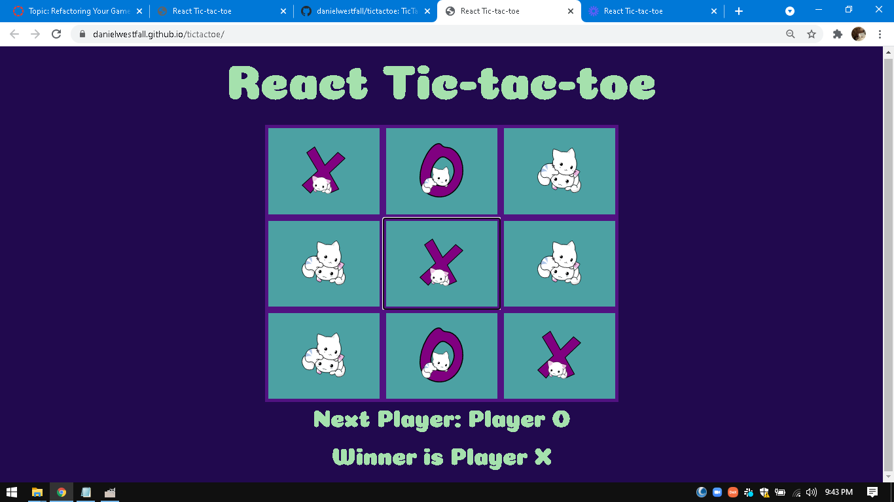

# Project Name
> [TicTacToe Project - Click here to view!](https://danielwestfall.github.io/tictactoe/tictactoe.html) 

## Table of contents
---
* [General info](#general-info)
* [Links](#links)
* [Screenshots](#screenshots)
* [Technologies](#technologies)
* [Setup](#setup)
* [Features](#features)
* [Status](#status)
* [Inspiration](#inspiration)
* [Contact](#contact)

## General info
---
What I learned from this project:
* Implementation of user-friendly UI and React components
* State management of various UI elements

## Links
---
* [Open the Project](https://danielwestfall.github.io/tictactoe/tictactoe.html)
* [View it on GitHub](https://danielwestfall.github.io/tictactoe/)

## Screenshots
---

## Technologies
---
* HTML
* CSS
* JavaScript
* ReactJS

## Setup
---
Feel free to [check out the project here!](https://danielwestfall.github.io/tictactoe/tictactoe.html).

## Features
---
List of features ready:
* Working TicTacToe game with cute cats!

To-do list:
* 	Add a feature to count win-loss-draw & reset option
*	  Add tournament mode - best of _ or first to _
*	  Add a reset board button that happens on a draw
*	  Add notification of a draw
*	  Add a visual representation of the winning set

## Status
---
Project is: _in progress_

Project was class assignment to refactor the code from the TicTacToe game assignment.

## Inspiration
---
Project created by MIT xPro Full Stack Web Development Course. Completed and modified by Daniel Westfall.

The cute cats are from [here](https://publicdomainvectors.org/en/free-clipart/Cute-kittens-vector-drawing/15553.html)

## Contact
---
[Daniel Westfall](mailto:DWWestfall@Protonmail.com).  Check out [my Portfolio](https://danielwestfall.github.io/ "my Portfolio")

## License
---
MIT License

Copyright (c) 2021 Daniel Westfall

Permission is hereby granted, free of charge, to any person obtaining a copy
of this software and associated documentation files (the "Software"), to deal
in the Software without restriction, including without limitation the rights
to use, copy, modify, merge, publish, distribute, sublicense, and/or sell
copies of the Software, and to permit persons to whom the Software is
furnished to do so, subject to the following conditions:

The above copyright notice and this permission notice shall be included in all
copies or substantial portions of the Software.

THE SOFTWARE IS PROVIDED "AS IS", WITHOUT WARRANTY OF ANY KIND, EXPRESS OR
IMPLIED, INCLUDING BUT NOT LIMITED TO THE WARRANTIES OF MERCHANTABILITY,
FITNESS FOR A PARTICULAR PURPOSE AND NONINFRINGEMENT. IN NO EVENT SHALL THE
AUTHORS OR COPYRIGHT HOLDERS BE LIABLE FOR ANY CLAIM, DAMAGES OR OTHER
LIABILITY, WHETHER IN AN ACTION OF CONTRACT, TORT OR OTHERWISE, ARISING FROM,
OUT OF OR IN CONNECTION WITH THE SOFTWARE OR THE USE OR OTHER DEALINGS IN THE
SOFTWARE.
